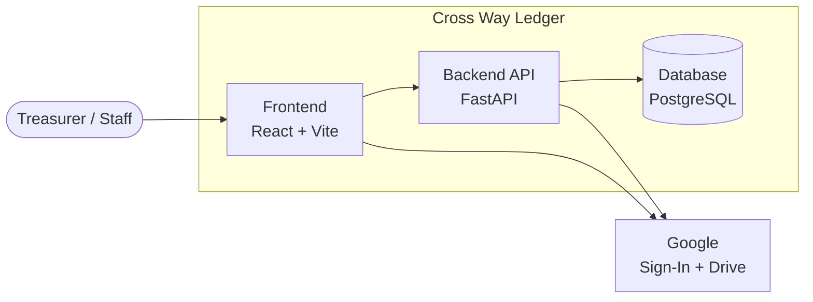
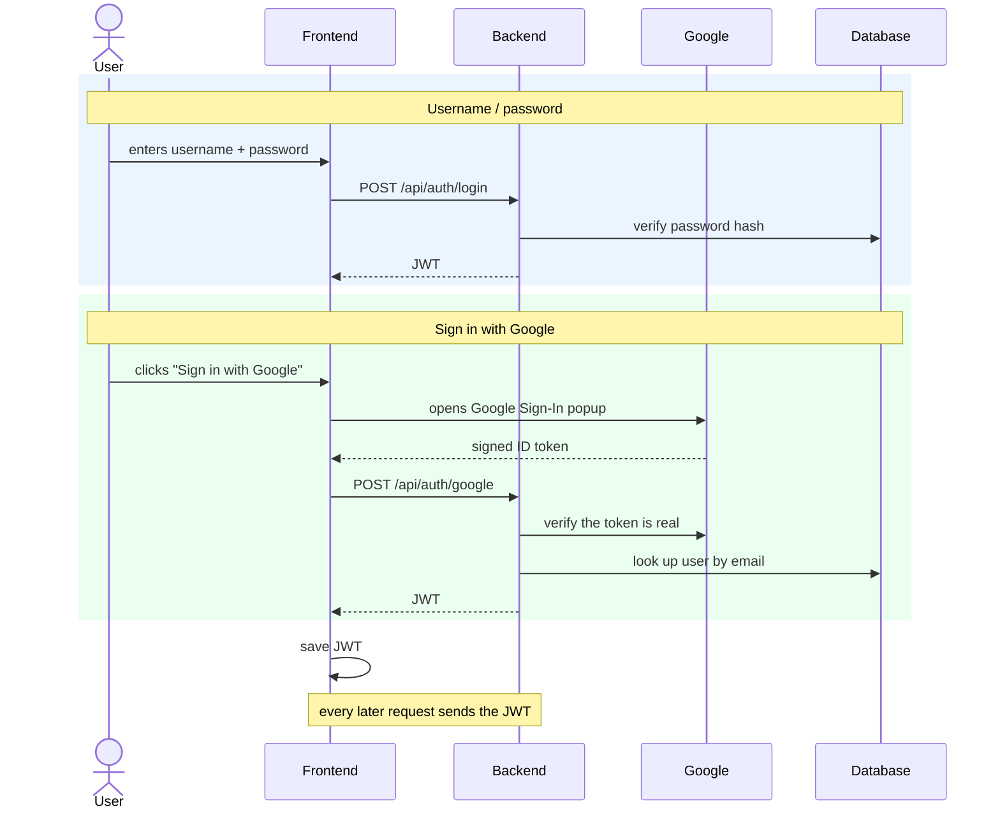
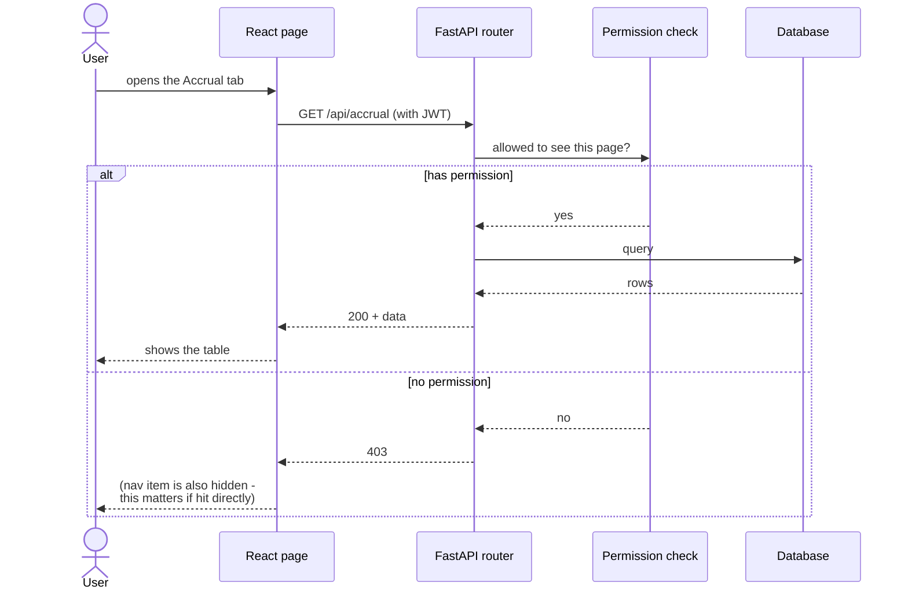
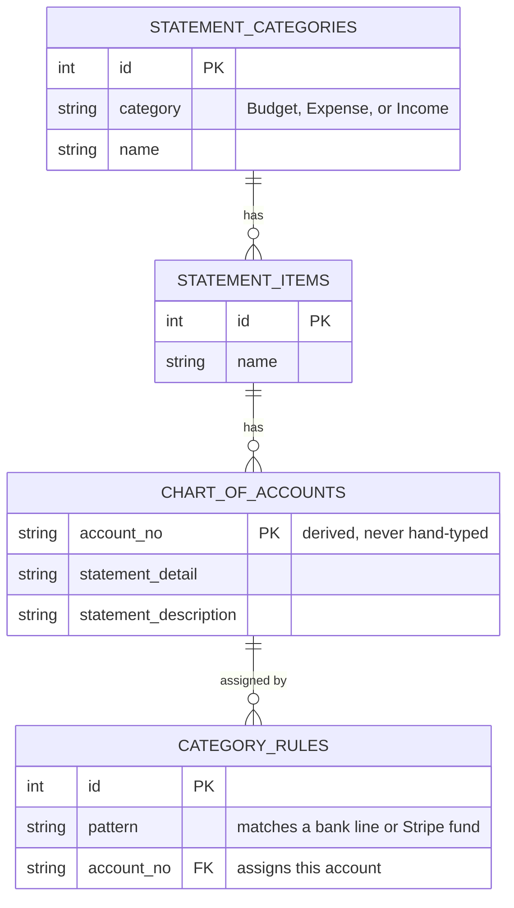
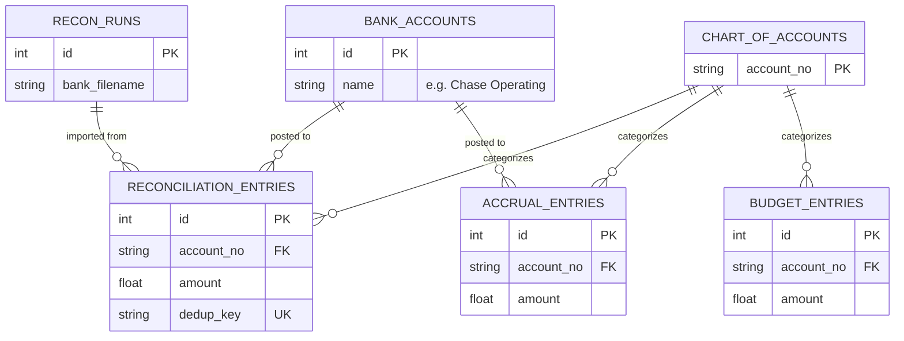
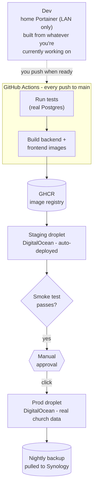

# Architecture

_How Cross Way Ledger is put together: the layers, how a user gets signed in,
how a request flows from click to database and back, and the full table
diagram. Diagrams are [Mermaid](https://mermaid.js.org/) - GitHub renders
them automatically right here, no extra tool needed._

---

## 1. System overview

- **Frontend** - a single-page React app. Holds the login session, calls the
  backend, and is the only place that talks to Google's Sign-In and Drive
  Picker UI directly.
- **Backend** - one FastAPI process. Every route sits behind an auth check
  before it touches the database.
- **Database** - SQLite locally, PostgreSQL in production - same code either
  way.
- **Google** - verifies who's signing in, and stores receipt files (the app
  never sees a Google password or keeps a copy of the file itself).

- The **frontend** is a single-page React app (no server-side rendering) -
  it talks to the backend purely over `fetch()` calls to `/api/...`, carrying
  a JWT in the `Authorization: Bearer` header once signed in. It's also the
  *only* place that talks to Google's Sign-In and Drive Picker UI directly -
  the backend never sees a Google password, only a token to verify.
- The **backend** is one FastAPI process. Every route is grouped into a
  router file (`app/routers/*.py`), each guarded by an auth dependency
  before it touches the database.
- The **database** is PostgreSQL everywhere - dev, CI tests, staging, and
  prod all run the identical engine (`docker-compose.yml` provisions it as
  the `db` service). There is no SQLite fallback anywhere: an earlier
  version of this app allowed one for zero-setup local dev, but a real
  schema bug once hid behind that gap (it only surfaced once tested against
  real Postgres) - see [DEPLOYMENT.md](DEPLOYMENT.md) for why environment
  parity is treated as a hard requirement, not a nice-to-have.
- **Google** is only ever talked to directly by the browser (Sign-In button,
  Drive file picker) or by the backend for two narrow purposes: verifying a
  Google Sign-In token really came from Google, and creating/finding the
  dated Drive folder receipts get filed under. The app never stores a
  Google password or a long-lived Drive credential - see the receipt
  attachment flow in `docs/PROJECT.md`.

---

## 2. Authentication - two ways in, one session afterward

Key points:

- **Both paths end the same way**: a JWT signed by our own backend
  (`security.py`'s `create_access_token`). Google is only involved in the
  Google path, and only to *vouch for the person's identity* - it never
  issues the token the rest of the app actually trusts.
- **Google accounts must be pre-added by an admin** (on the Users page, by
  email) before that email can sign in - an unrecognized email is rejected
  rather than silently creating an account.
- The domain restriction (`crosswaymtc.org`) is checked **twice**: once by
  Google's own OAuth consent screen (set to Internal), and independently by
  the backend reading the token's `hd` claim - so it doesn't rely on a
  single point of configuration in the Google Cloud Console.

---

## 3. A typical request - how a page actually gets its data

This same shape repeats for every page - only the router and the permission
key change. The permission check happens **on the backend**, not just by
hiding the nav button, so a page you don't have access to is actually
inaccessible, not just invisible.

A few tables are the exception: **Chart of Accounts** and **Bank Accounts**
`GET` endpoints stay open to *any* signed-in user (not gated by a specific
permission), because other pages' pickers (e.g. choosing an account on a
transaction) need to read them regardless of which pages that user has been
granted. Only *editing* those two is permission-gated.

---

## 4. Data model

Split into two diagrams - one crowded diagram with all 12 tables rendered
too small to read, so this is the Chart of Accounts hierarchy on its own,
then the ledgers that categorize against it. Each box shows only its most
important fields, not every column - see `backend/app/models.py` for the
complete field list.

### 4a. Chart of Accounts hierarchy

3 levels: Category → Item → Account (the leaf/"Detail" level). `account_no`
is always built from the chain (never typed by hand). Rules assign an
account automatically during Upload based on a bank keyword or Stripe fund
name match.

### 4b. Ledgers

- **Actual** (`RECONCILIATION_ENTRIES`), **Accrual**, and **Budget** are
  three separate ledgers, all categorized against the same Chart of
  Accounts. Actual and Accrual also carry a `bank_account_id`, a receipt
  (Google Drive file id/link), and split/undo-split support (a child row
  points back at its original via `split_parent_id`, not shown above to
  keep this readable).
- `RECON_RUNS` is the *preview* output of one Upload wizard run - pushing it
  into Actual is what creates the persistent `RECONCILIATION_ENTRIES` rows.
- The `account_no` links in both diagrams are real, enforced foreign key
  constraints (nullable on the three ledgers - `NULL` means uncategorized).
  Schema changes go through Alembic migrations now, not hand-written
  `ALTER TABLE` statements - see
  [DEPLOYMENT.md](DEPLOYMENT.md#7-database-migrations).
- Not pictured: `USERS` and `APP_SETTINGS` - standalone tables that
  configure the app itself, not tied to any of the above.

---

## 5. Environments & deployment pipeline

Four environments, each with a distinct job - see
[DEPLOYMENT.md](DEPLOYMENT.md) for the full setup instructions for each.

| Environment | Runs on | Purpose | Who/what updates it |
| --- | --- | --- | --- |
| **Dev** | Your home Portainer instance | Try out in-progress code before it's committed | You, on demand, from your local checkout |
| **CI tests** | GitHub Actions (ephemeral) | Gate every push/PR - not a running environment | GitHub, automatically |
| **Staging** | DigitalOcean droplet | Verify a real build against a real domain/HTTPS/Postgres before it touches church data | CI, automatically, on every push to `main` |
| **Prod** | DigitalOcean droplet | The real app the church uses | CI, only after a human clicks Approve |

**Why dev can't just be "whatever's on staging"**: staging's job is to show
*exactly* what's about to go to prod, so someone can trust it as a pre-prod
checkpoint. If dev work (unmerged, unreviewed) could land there too, staging
would stop meaning anything. Keeping dev on separate, LAN-only hardware
means an in-progress mistake there can never be mistaken for "what's about
to ship."

**Why every environment runs identical Postgres + Caddy + Docker Compose**:
mismatched environments hide bugs until the worst possible moment. This
project hit exactly that once already - a schema bug only surfaced when
tests started running against real Postgres instead of SQLite (see
[STATUS.md](STATUS.md)). Same stack everywhere means "worked in dev" is
actually predictive of "will work in prod."

---

_See [PROJECT.md](PROJECT.md) for the full feature-by-feature knowledge base
and [DEPLOYMENT.md](DEPLOYMENT.md) for how this actually gets run on a
server._
