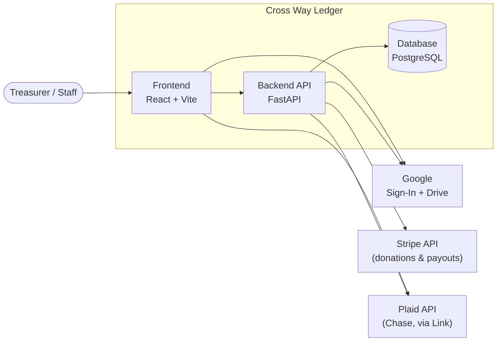
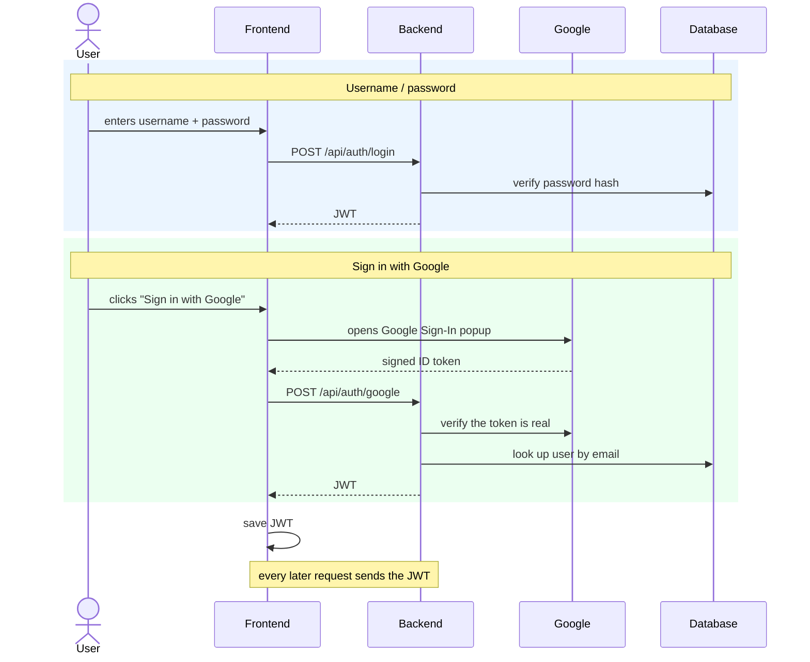
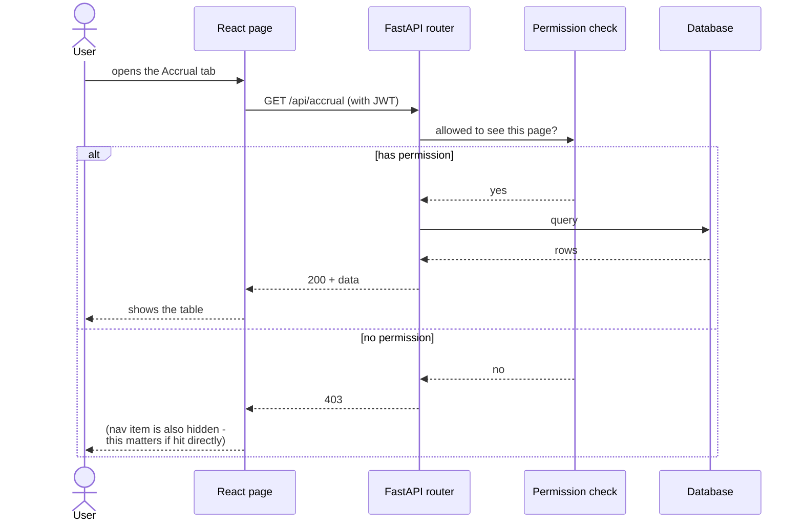
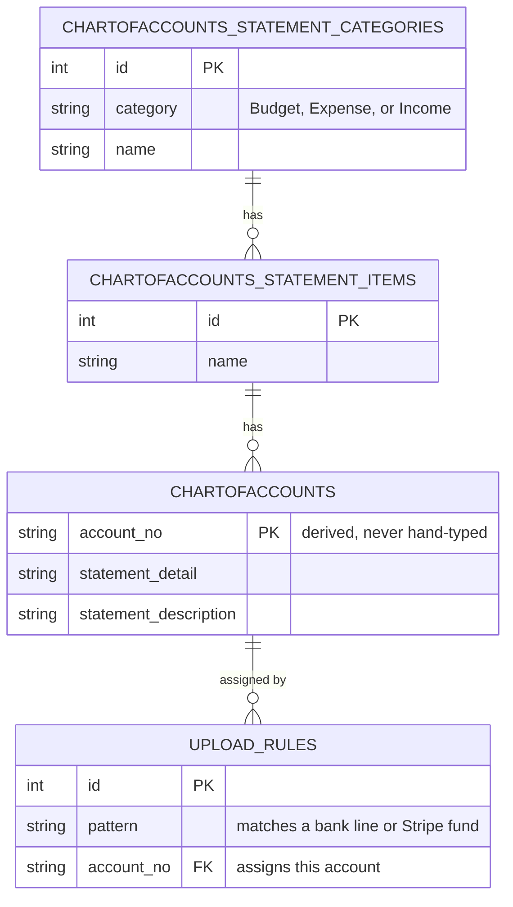
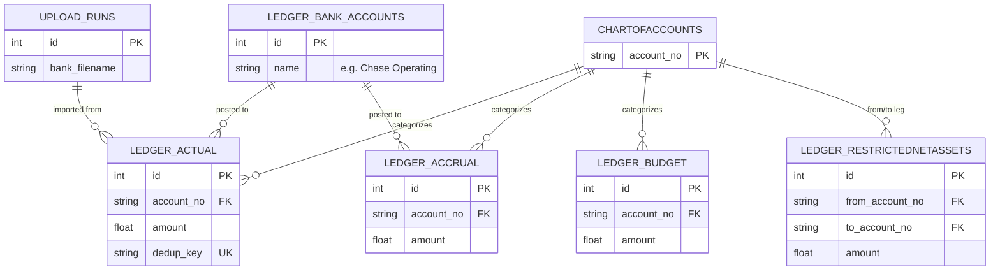
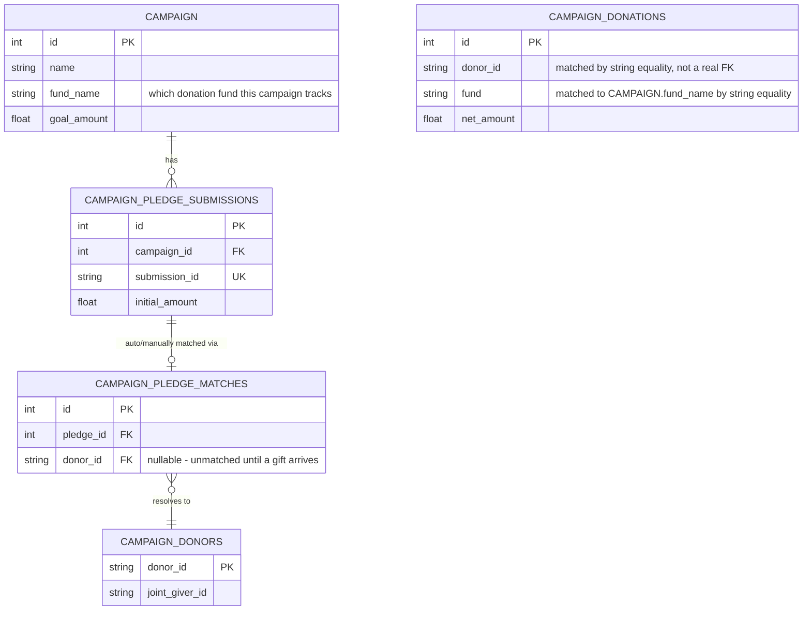
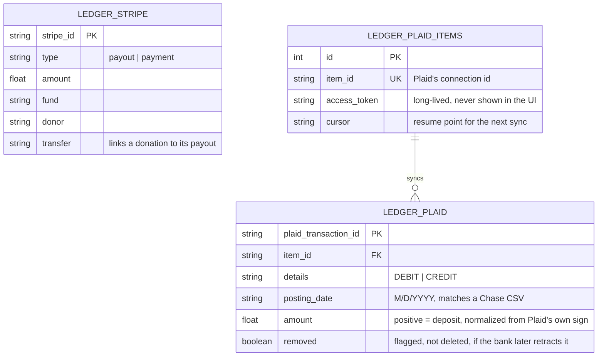
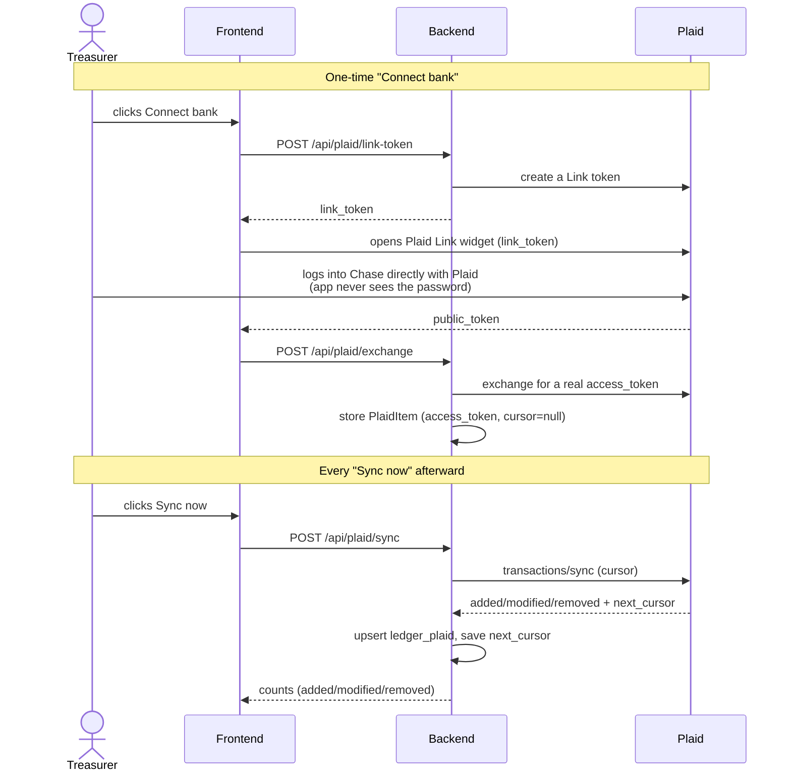
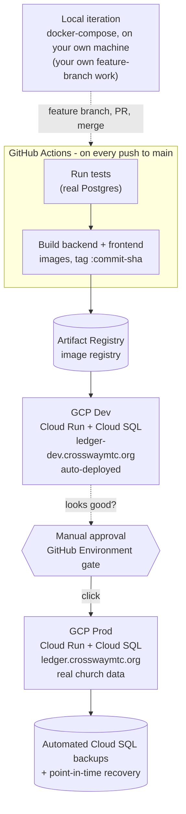

# Architecture

_How Cross Way Ledger is put together: the layers, how a user gets signed in,
how a request flows from click to database and back, and the full table
diagram. Diagrams are [Mermaid](https://mermaid.js.org/) - GitHub renders
them automatically right here, no extra tool needed._

---

## 1. System overview

```mermaid
%%{init: {"themeVariables": {"fontSize": "20px"}, "flowchart": {"nodeSpacing": 50, "rankSpacing": 70}}}%%
flowchart LR
    User(["Treasurer / Staff"])

    subgraph App["Cross Way Ledger"]
        direction LR
        FE["Frontend\nReact + Vite"]
        BE["Backend API\nFastAPI"]
        DB[("Database\nPostgreSQL")]
        FE --> BE --> DB
    end

    Google["Google\nSign-In + Drive"]
    Stripe["Stripe API\n(donations & payouts)"]
    Plaid["Plaid API\n(Chase, via Link)"]

    User --> FE
    FE --> Google
    FE --> Plaid
    BE --> Google
    BE --> Stripe
    BE --> Plaid
```

- **Frontend** - a single-page React app. Holds the login session, calls the
  backend, and is the only place that talks to Google's Sign-In and Drive
  Picker UI directly.
- **Backend** - one FastAPI process. Every route sits behind an auth check
  before it touches the database.
- **Database** - PostgreSQL everywhere: local development, automated tests,
  and both cloud environments run the identical engine.
- **Google** - verifies who's signing in, and stores receipt files (the app
  never sees a Google password or keeps a copy of the file itself).

- The **frontend** is a single-page React app (no server-side rendering) -
  it talks to the backend purely over `fetch()` calls to `/api/...`, carrying
  a JWT in the `Authorization: Bearer` header once signed in. It's also the
  *only* place that talks to Google's Sign-In and Drive Picker UI directly -
  the backend never sees a Google password, only a token to verify.
- The **backend** is one FastAPI process. Every route is grouped into a
  router file (`app/routers/*.py`), each guarded by an auth dependency
  before it touches the database.
- The **database** is PostgreSQL everywhere - local development
  (`docker-compose.yml` provisions it as the `db` service), automated
  tests, and both cloud environments (Cloud SQL) all run the identical
  engine. There is no SQLite fallback anywhere: an earlier version of this
  app allowed one for zero-setup local dev, but a real schema bug once hid
  behind that gap (it only surfaced once tested against real Postgres) -
  see [DEPLOYMENT.md](DEPLOYMENT.md) for why environment parity is treated
  as a hard requirement, not a nice-to-have.
- **Google** is only ever talked to directly by the browser (Sign-In button,
  Drive file picker) or by the backend for two narrow purposes: verifying a
  Google Sign-In token really came from Google, and creating/finding the
  dated Drive folder receipts get filed under. The app never stores a
  Google password or a long-lived Drive credential - see the receipt
  attachment flow in `docs/PROJECT.md`.
- **Stripe** and **Plaid** are the two automated bank/payment sync
  integrations (Stripe donations/payouts, Plaid → Chase). Both follow the
  identical pattern: pull data into a dedicated staging table
  (`ledger_stripe` / `ledger_plaid`), never touch a real ledger directly.
  See § 4d and the [Stripe](guides/stripe-sync.md) /
  [Bank Transactions](guides/bank-transactions-plaid-sync.md) guides. Plaid
  additionally involves the **frontend** directly for its Link widget (the
  one-time "Connect bank" consent flow) - see
  `frontend/src/lib/plaidLink.ts`.

---

## 2. Authentication - two ways in, one session afterward

```mermaid
%%{init: {"themeVariables": {"fontSize": "18px"}}}%%
sequenceDiagram
    actor U as User
    participant FE as Frontend
    participant BE as Backend
    participant G as Google
    participant DB as Database

    rect rgb(235, 245, 255)
    note over U,DB: Username / password
    U->>FE: enters username + password
    FE->>BE: POST /api/auth/login
    BE->>DB: verify password hash
    BE-->>FE: JWT
    end

    rect rgb(235, 255, 240)
    note over U,DB: Sign in with Google
    U->>FE: clicks "Sign in with Google"
    FE->>G: opens Google Sign-In popup
    G-->>FE: signed ID token
    FE->>BE: POST /api/auth/google
    BE->>G: verify the token is real
    BE->>DB: look up user by email
    BE-->>FE: JWT
    end

    FE->>FE: save JWT
    note over FE,BE: every later request sends the JWT
```

Key points:

- **Both paths end the same way**: a JWT signed by our own backend
  (`security.py`'s `create_access_token`). Google is only involved in the
  Google path, and only to *vouch for the person's identity* - it never
  issues the token the rest of the app actually trusts.
- **Google accounts must be pre-added by an admin** (on the Users page, by
  email) before that email can sign in - an unrecognized email is rejected
  rather than silently creating an account.
- The domain restriction (`crosswaymtc.org`) is checked **twice**: once by
  Google's own OAuth consent screen (set to Internal), and independently by
  the backend reading the token's `hd` claim - so it doesn't rely on a
  single point of configuration in the Google Cloud Console.

---

## 3. A typical request - how a page actually gets its data

```mermaid
%%{init: {"themeVariables": {"fontSize": "18px"}}}%%
sequenceDiagram
    actor U as User
    participant Page as React page
    participant Router as FastAPI router
    participant Perm as Permission check
    participant DB as Database

    U->>Page: opens the Accrual tab
    Page->>Router: GET /api/accrual (with JWT)
    Router->>Perm: allowed to see this page?

    alt has permission
        Perm-->>Router: yes
        Router->>DB: query
        DB-->>Router: rows
        Router-->>Page: 200 + data
        Page-->>U: shows the table
    else no permission
        Perm-->>Router: no
        Router-->>Page: 403
        Page-->>U: (nav item is also hidden -<br/>this matters if hit directly)
    end
```

This same shape repeats for every page - only the router and the permission
key change. The permission check happens **on the backend**, not just by
hiding the nav button, so a page you don't have access to is actually
inaccessible, not just invisible.

A few tables are the exception: **Chart of Accounts** and **Bank Accounts**
`GET` endpoints stay open to *any* signed-in user (not gated by a specific
permission), because other pages' pickers (e.g. choosing an account on a
transaction) need to read them regardless of which pages that user has been
granted. Only *editing* those two is permission-gated.

---

## 4. Data model

Split into three diagrams rather than one crowded 18-table diagram: the
Chart of Accounts hierarchy, the ledgers that categorize against it, and
the Pledge Campaigns domain (which shares no foreign keys with the other
two - it's linked only by a `fund` name match, see 4c). Each box shows only
its most important fields, not every column - see `backend/app/models.py`
for the complete field list. Table names below are the real, current
Postgres table names (see the "rename tables to standardized names"
migration and [DATA_DICTIONARY.md](DATA_DICTIONARY.md) for the full
before/after mapping).

### 4a. Chart of Accounts hierarchy

```mermaid
%%{init: {"themeVariables": {"fontSize": "18px"}}}%%
erDiagram
    CHARTOFACCOUNTS_STATEMENT_CATEGORIES {
        int id PK
        string category "Budget, Expense, or Income"
        string name
    }
    CHARTOFACCOUNTS_STATEMENT_ITEMS {
        int id PK
        string name
    }
    CHARTOFACCOUNTS {
        string account_no PK "derived, never hand-typed"
        string statement_detail
        string statement_description
    }
    UPLOAD_RULES {
        int id PK
        string pattern "matches a bank line or Stripe fund"
        string account_no FK "assigns this account"
    }

    CHARTOFACCOUNTS_STATEMENT_CATEGORIES ||--o{ CHARTOFACCOUNTS_STATEMENT_ITEMS : has
    CHARTOFACCOUNTS_STATEMENT_ITEMS ||--o{ CHARTOFACCOUNTS : has
    CHARTOFACCOUNTS ||--o{ UPLOAD_RULES : "assigned by"
```

3 levels: Category → Item → Account (the leaf/"Detail" level). `account_no`
is always built from the chain (never typed by hand). `UPLOAD_RULES`
assigns an account automatically during Upload based on a bank keyword or
Stripe fund name match.

### 4b. Ledgers

```mermaid
%%{init: {"themeVariables": {"fontSize": "18px"}}}%%
erDiagram
    CHARTOFACCOUNTS {
        string account_no PK
    }
    LEDGER_BANK_ACCOUNTS {
        int id PK
        string name "e.g. Chase Operating"
    }
    UPLOAD_RUNS {
        int id PK
        string bank_filename
    }
    LEDGER_ACTUAL {
        int id PK
        string account_no FK
        float amount
        string dedup_key UK
    }
    LEDGER_ACCRUAL {
        int id PK
        string account_no FK
        float amount
    }
    LEDGER_BUDGET {
        int id PK
        string account_no FK
        float amount
    }
    LEDGER_RESTRICTEDNETASSETS {
        int id PK
        string from_account_no FK
        string to_account_no FK
        float amount
    }

    CHARTOFACCOUNTS ||--o{ LEDGER_ACTUAL : categorizes
    CHARTOFACCOUNTS ||--o{ LEDGER_ACCRUAL : categorizes
    CHARTOFACCOUNTS ||--o{ LEDGER_BUDGET : categorizes
    CHARTOFACCOUNTS ||--o{ LEDGER_RESTRICTEDNETASSETS : "from/to leg"
    LEDGER_BANK_ACCOUNTS ||--o{ LEDGER_ACTUAL : "posted to"
    LEDGER_BANK_ACCOUNTS ||--o{ LEDGER_ACCRUAL : "posted to"
    UPLOAD_RUNS ||--o{ LEDGER_ACTUAL : "imported from"
```

- **Actual** (`LEDGER_ACTUAL`), **Accrual**, and **Budget** are three
  separate ledgers, all categorized against the same Chart of Accounts.
  Actual and Accrual also carry a `bank_account_id`, a receipt (Google
  Drive file id/link), and split/undo-split support (a child row points
  back at its original via `split_parent_id`, not shown above to keep this
  readable).
- **Restricted Net Assets** (`LEDGER_RESTRICTEDNETASSETS`) is a permanent
  reclassification between two Chart-of-Accounts lines, stored as a single
  row with both legs (`from_account_no`/`to_account_no`) - General Ledger
  synthesizes the two per-account lines from this one row at read time.
- `UPLOAD_RUNS` is the *preview* output of one Upload wizard run - pushing
  it into Actual is what creates the persistent `LEDGER_ACTUAL` rows.
- General Ledger itself isn't a table - it's a Postgres view
  (`reporting.vw_ledger_generalledger`) that unions all four ledgers above.
- The `account_no` links in both diagrams are real, enforced foreign key
  constraints (nullable on the ledgers - `NULL` means uncategorized).
  Schema changes go through Alembic migrations now, not hand-written
  `ALTER TABLE` statements - see
  [DEPLOYMENT.md](DEPLOYMENT.md#7-database-migrations).
- Not pictured: `USERS` and `APP_SETTINGS` - standalone tables that
  configure the app itself, not tied to any of the above.

### 4c. Pledge Campaigns

```mermaid
%%{init: {"themeVariables": {"fontSize": "18px"}}}%%
erDiagram
    CAMPAIGN {
        int id PK
        string name
        string fund_name "which donation fund this campaign tracks"
        float goal_amount
    }
    CAMPAIGN_PLEDGE_SUBMISSIONS {
        int id PK
        int campaign_id FK
        string submission_id UK
        float initial_amount
    }
    CAMPAIGN_PLEDGE_MATCHES {
        int id PK
        int pledge_id FK
        string donor_id FK "nullable - unmatched until a gift arrives"
    }
    CAMPAIGN_DONORS {
        string donor_id PK
        string joint_giver_id
    }
    CAMPAIGN_DONATIONS {
        int id PK
        string donor_id "matched by string equality, not a real FK"
        string fund "matched to CAMPAIGN.fund_name by string equality"
        float net_amount
    }

    CAMPAIGN ||--o{ CAMPAIGN_PLEDGE_SUBMISSIONS : has
    CAMPAIGN_PLEDGE_SUBMISSIONS ||--o| CAMPAIGN_PLEDGE_MATCHES : "auto/manually matched via"
    CAMPAIGN_PLEDGE_MATCHES }o--|| CAMPAIGN_DONORS : "resolves to"
```

- This domain shares no foreign keys with the Chart of Accounts/ledgers
  above - a campaign only cares about donations whose `fund` value matches
  its own `fund_name`, checked by plain string equality at read time (see
  `routers/pledge_campaigns.py`), not a database constraint.
- `CAMPAIGN_DONATIONS` is the Giving App's full donation export, imported
  in full and not scoped to any one campaign - a campaign just declares
  which `fund` value it cares about after the fact.
- `CAMPAIGN_PLEDGE_MATCHES` is nullable by design: most pledges start
  unmatched (no gift yet, so no donor row exists), and auto-matching (by
  email) fills it in later without ever overwriting a manual match.
- Reporting: `reporting` schema also exposes `vw_ledger_generalledger` for
  the ledgers above - the campaign tables have no equivalent view, since
  their own table names are already clean/direct to query.

### 4d. Automated bank/payment sync staging tables (Stripe, Plaid)

```mermaid
%%{init: {"themeVariables": {"fontSize": "18px"}}}%%
erDiagram
    LEDGER_STRIPE {
        string stripe_id PK
        string type "payout | payment"
        float amount
        string fund
        string donor
        string transfer "links a donation to its payout"
    }
    LEDGER_PLAID_ITEMS {
        int id PK
        string item_id UK "Plaid's connection id"
        string access_token "long-lived, never shown in the UI"
        string cursor "resume point for the next sync"
    }
    LEDGER_PLAID {
        string plaid_transaction_id PK
        string item_id FK
        string details "DEBIT | CREDIT"
        string posting_date "M/D/YYYY, matches a Chase CSV"
        float amount "positive = deposit, normalized from Plaid's own sign"
        boolean removed "flagged, not deleted, if the bank later retracts it"
    }

    LEDGER_PLAID_ITEMS ||--o{ LEDGER_PLAID : syncs
```

- **Both tables are staging areas, not ledgers** - neither has a foreign key
  into `chartofaccounts`, and neither is read by General Ledger or Income
  Statement. Reconciling this data into a real ledger entry still happens
  through the [Upload Wizard](guides/bank-reconciliation-upload-wizard.md);
  see [issue #105](https://github.com/treasurer-cwmtc/cross-way-ledger/issues/105)
  for wiring that up as a direct alternative to a manual CSV upload.
- **Deliberately shaped to match the wizard's existing manual-upload row
  types** - `ledger_stripe` mirrors `StripeRow`, `ledger_plaid` mirrors
  `BankRow` (see `backend/app/services/parsers.py`) - column-for-column,
  not Stripe's or Plaid's own native field names. This is why a backend
  test (`test_api_path_matches_csv_path_for_the_same_donation` in
  `test_stripe_sync.py`) directly asserts a CSV-parsed row and an
  API-synced row for the same real-world transaction come out identical on
  every field the reconciler reads - the two ingestion paths must never be
  allowed to silently diverge.
- **`ledger_stripe`** is fully re-synced and re-upserted (keyed by
  `stripe_id`) on every "Sync now" - simple and self-healing (a later
  refund/amendment is picked up automatically), affordable at this
  account's transaction volume. Stripe's own API is called directly with a
  secret key - no separate "connect" step, no per-item access token.
- **`ledger_plaid` / `ledger_plaid_items`** use Plaid's cursor-based
  `transactions/sync` endpoint instead - each sync resumes from
  `ledger_plaid_items.cursor` rather than re-scanning a date window, and a
  connection has to be established once first (Plaid's Link widget, an
  OAuth-style consent flow - see the sequence below) before anything can
  sync at all. Plaid's own amount-sign convention (positive = money out) is
  the opposite of this app's (positive = deposit); `plaid_txn_to_fields()`
  negates it on the way in, so nothing downstream needs to know Plaid's
  convention exists.
- **How duplicate syncs are prevented, for both integrations**: every row
  is keyed by the provider's own unique transaction id (`stripe_id` /
  `plaid_transaction_id`, each the table's primary key), and every sync is
  an **upsert** - look up by that id, update the existing row if found,
  insert only if not. Neither integration ever blindly `INSERT`s. This is
  what makes it safe to click Sync now repeatedly, run the nightly
  scheduled job on top of a manual sync that just happened, or re-run a
  large backfill after fixing a bug partway through (see the
  `StringDataRightTruncation` incident referenced in
  [STATUS.md](STATUS.md)) - none of these can ever create a second row for
  a transaction already synced. The two providers reach that guarantee
  differently: Stripe has no concept of "since last time," so the sync
  re-fetches the *entire* lookback window every call and relies purely on
  the upsert-by-`stripe_id` to make that idempotent; Plaid's own
  cursor-based API does the "what changed" filtering server-side, and the
  upsert-by-id is then just a safety net on top of that. **This only
  covers the two staging tables themselves** - it says nothing about
  duplicates once this data is later imported into a real ledger (Actual),
  which has its own separate dedup mechanism
  (`ledger_actual.dedup_key`) that doesn't apply here yet; see
  [issue #105](https://github.com/treasurer-cwmtc/cross-way-ledger/issues/105).

```mermaid
%%{init: {"themeVariables": {"fontSize": "18px"}}}%%
sequenceDiagram
    actor U as Treasurer
    participant FE as Frontend
    participant BE as Backend
    participant P as Plaid

    note over U,P: One-time "Connect bank"
    U->>FE: clicks Connect bank
    FE->>BE: POST /api/plaid/link-token
    BE->>P: create a Link token
    BE-->>FE: link_token
    FE->>P: opens Plaid Link widget (link_token)
    U->>P: logs into Chase directly with Plaid<br/>(app never sees the password)
    P-->>FE: public_token
    FE->>BE: POST /api/plaid/exchange
    BE->>P: exchange for a real access_token
    BE->>BE: store PlaidItem (access_token, cursor=null)

    note over U,P: Every "Sync now" afterward
    U->>FE: clicks Sync now
    FE->>BE: POST /api/plaid/sync
    BE->>P: transactions/sync (cursor)
    P-->>BE: added/modified/removed + next_cursor
    BE->>BE: upsert ledger_plaid, save next_cursor
    BE-->>FE: counts (added/modified/removed)
```

Once connected, **nobody re-authenticates for routine use** - the
`access_token` is a property of the app's connection to Chase, not of
whichever user happened to click Connect bank, so every subsequent sync (by
anyone with the `plaid` permission) reuses it silently. See the
[Bank Transactions guide](guides/bank-transactions-plaid-sync.md) for the
user-facing explanation of this and for why the whole integration is
currently pointed at Plaid's **Sandbox** environment, not real Chase data.

---

## 5. Environments & deployment pipeline

Local iteration, automated tests, a real cloud dev environment, then a real
cloud prod environment - each with a distinct job. See
[DEPLOYMENT.md](DEPLOYMENT.md) for the full setup instructions for each.

```mermaid
%%{init: {"themeVariables": {"fontSize": "18px"}}}%%
flowchart TB
    Local["Local iteration\ndocker-compose, on your own machine\n(your own feature-branch work)"]

    subgraph CI["GitHub Actions - on every push to main"]
        direction LR
        Test["Run tests\n(real Postgres)"] --> Build["Build backend + frontend\nimages, tag :commit-sha"]
    end

    AR[("Artifact Registry\nimage registry")]
    DevEnv["GCP Dev\nCloud Run + Cloud SQL\nledger-dev.crosswaymtc.org\nauto-deployed"]
    Approve{{"Manual approval\nGitHub Environment gate"}}
    ProdEnv["GCP Prod\nCloud Run + Cloud SQL\nledger.crosswaymtc.org\nreal church data"]
    Backup[("Automated Cloud SQL backups\n+ point-in-time recovery")]

    Local -.->|"feature branch, PR, merge"| CI
    Build --> AR
    AR --> DevEnv
    DevEnv -.->|"looks good?"| Approve
    Approve -->|click| ProdEnv
    ProdEnv --> Backup
```

| Environment | Runs on | Purpose | Who/what updates it |
| --- | --- | --- | --- |
| **Local** | `docker compose up`, on your own machine | Iterate on a feature branch before it's reviewed or merged | You, on demand, from your local checkout |
| **CI tests** | GitHub Actions (ephemeral) | Gate every push/PR - not a running environment | GitHub, automatically |
| **GCP Dev** | Cloud Run + Cloud SQL, `ledger-dev.crosswaymtc.org` | Verify a real build against real cloud infra before it touches church data | GitHub Actions, automatically, on every push to `main` |
| **GCP Prod** | Cloud Run + Cloud SQL, `ledger.crosswaymtc.org` | The real app the church uses | GitHub Actions, only after a human approves the `production` deployment gate |

Both Cloud SQL instances (`ledger-db-dev`, `ledger-db-prod`) run identical
Postgres, with automated daily backups and point-in-time recovery enabled
on both.

**"Build once, promote to prod"**: the same backend/frontend container
images built for a commit are deployed to dev first, then - unchanged - to
prod after approval. The frontend doesn't bake its API URL in at build
time (an earlier build-time approach broke this exact promotion model,
since dev's built image would forever point at dev): instead, a
container-startup script generates a small `window.__ENV__` config from a
per-environment `API_BASE` variable, so the identical image works
correctly in both environments.

**Migrations run automatically**: each backend container runs
`alembic upgrade head` before starting the server, in every environment -
there's no separate manual migration step.

**Why dev can't just be "whatever's on my machine"**: GCP Dev's job is to
show *exactly* what's about to go to prod - the same container image,
the same cloud infrastructure, the same migration path - so a human can
trust it as a genuine pre-prod checkpoint. Local iteration stays on
separate, unpublished infrastructure so an in-progress mistake there can
never be mistaken for "what's about to ship."

**Why every environment runs identical Postgres**: mismatched environments
hide bugs until the worst possible moment. This project hit exactly that
once already - a schema bug only surfaced when tests started running
against real Postgres instead of SQLite (see [STATUS.md](STATUS.md)). Same
database engine everywhere means "worked in dev" is actually predictive of
"will work in prod."

---

_See [PROJECT.md](PROJECT.md) for the full feature-by-feature knowledge base
and [DEPLOYMENT.md](DEPLOYMENT.md) for how this actually gets run on a
server._
